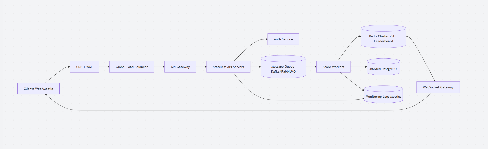

# Scalable Scoreboard System

## 1. Overview

This module handles:

- User score updates
- Real-time leaderboard (Top 10)
- High scalability for millions of users
- Security against malicious behavior


## 2. Goals

- Support **millions of users**
- Handle **high write throughput**
- Provide **real-time leaderboard updates**
- Ensure **data integrity & anti-cheat protection**


## High-Level Architecture




## 3. Processing Flow

1. Client sends action request  
2. API validates authentication (JWT)  
3. API pushes event to Message Queue (Kafka / RabbitMQ)  
4. Worker consumes event:
   - Validate action
   - Compute score (server-side logic)
   - Persist data to DB
   - Update Redis leaderboard
5. If leaderboard changes:
   - Push update via WebSocket

## 4. API Design
### 4.1 Authentication

#### Login

```
POST /auth/login

// Request body
{
  "email": "user@gmail.com",
  "password": "123456"
}

// Response
{
  "accessToken": "jwt_token",
  "refreshToken": "refresh_token"
}
```

#### Refresh token

```
POST /auth/refresh

// Response
{
  "accessToken": "new_jwt_access_token",
  "refreshToken": "new_refresh_token",
  "expiresIn": 3600
}
```

### 4.2 Score Update API

#### Submit Action

```
POST /actions/complete

// Headers
Authorization: Bearer <JWT>
Idempotency-Key: <uuid>

// Request
{
  "actionType": "JUMP_LEVEL_1",
  "metadata": {
    "level": 3
  }
}

//Response
{
  "success": true,
  "scoreAdded": 10,
  "newTotalScore": 120
}
```

### 4.3 Leaderboard APIs
#### Get Top 10 Leaderboard

```
GET /leaderboard/top

// Response
{
  "updatedAt": "2026-04-23T10:00:00Z",
  "data": [
    {
      "rank": 1,
      "userId": "u1",
      "score": 9990
    }
  ]
}
```
#### Get My Rank

```
GET /leaderboard/me
{
  "updatedAt": "2026-04-23T10:00:00Z",
  "data": 
    {
      "rank": 20,
      "userId": "u1",
      "score": 9990
    }
}
```

### 4.4 WebSocket API
```
// Connection
wss://api.example.com/ws/leaderboard

// Events
// Leaderboard Update
{
  "type": "LEADERBOARD_UPDATE",
  "data": [
    {
      "rank": 1,
      "userId": "u1",
      "score": 9990
    }
  ]
}
// User Score Update
{
  "type": "USER_SCORE_UPDATE",
  "userId": "u123",
  "score": 1200
}
```
### 4.5 API Server ↔ Worker Communication

#### Event Publishing
```
// Topic: score-events

// Events
{
  "eventId": "uuid",
  "type": "SCORE_UPDATE",
  "userId": "u123",
  "actionType": "JUMP_LEVEL_1",
  "scoreDelta": 10,
  "timestamp": 1710000000,
  "idempotencyKey": "uuid"
}
```
#### Worker Consumption

```
// Worker subscribe topic: score-events
Validate event
Check idempotency
Compute score
Persist DB
Update Redis (ZSET leaderboard)
```


## 5. Design Decisions

### 5.1 Async Architecture

- Prevent API overload
- Handle traffic spikes
- Enable retry mechanism
- Decouple system components


### 5.2 Redis Leaderboard Engine

Using Redis Sorted Set (ZSET):

```txt
key: leaderboard
member: userId
score: userScore
```

Operations
```bash
ZINCRBY leaderboard 10 user123
# Time Complexity: O(log N)

ZREVRANGE leaderboard 0 9 WITHSCORES
# Time Complexity: O(log N + K)
```

## 6. Real-time Updates

- WebSocket Gateway broadcasts changes to clients
- Only send updates when **Top 10 leaderboard changes**

### Optimization

- Avoid broadcasting every score update
- Batch updates when update frequency is high
- Reduce unnecessary WebSocket traffic to improve scalability


## 7. Database Strategy

- PostgreSQL used as primary persistent storage
- Data is sharded by `userId` to distribute load
- System follows an **eventual consistency model**
  - Redis is real-time source
  - PostgreSQL is durable source of truth


## 8. Caching Strategy

- Redis → used as leaderboard cache (ZSET)
- CDN → serves static assets (frontend, images, scripts)


## 9. Security Design (Anti-Cheat System)

### 9.1 Request Tampering

- All score updates are derived from server-side event processing only.
Client has no control over score computation.
- Strict validation of action type (whitelist-based)


### 9.2 Replay Attack Protection

- Use **idempotency keys** for every action request
- Request nonce validation to prevent duplicate execution


### 9.3 Bot / Automation Abuse

- Rate limiting per user and per IP
- CAPTCHA challenge for suspicious behavior
- Behavioral anomaly detection system (future enhancement)


### 9.4 Token Theft Protection

- Use short-lived JWT access tokens
- Refresh token rotation mechanism
- Revoke compromised sessions


### 9.5 DDoS Protection

- CDN absorbs traffic spikes at edge layer
- WAF (Web Application Firewall) filters malicious traffic
- API Gateway enforces rate limiting


## 10. Scaling Strategy

### Components Scaling Model

- **API Layer** → Stateless horizontal scaling
- **Workers** → Scale dynamically based on queue load
- **Redis** → Cluster mode for high throughput
- **WebSocket Gateway** → Sharded across multiple nodes
- **Database** → Sharded PostgreSQL for horizontal scalability


### Handling failure cases

#### 1. Redis Failure (Crash or Data Loss)

**Problem:**
Redis is an in-memory cache, so it can lose data if it crashes unexpectedly.

**Impact:**
- Leaderboard data may become inconsistent
- Recent score updates may be temporarily missing

**Solution:**
- Redis is NOT the source of truth
- Rebuild Redis from:
  - PostgreSQL (persistent storage), or
  - Kafka event log (preferred for full replay)


#### 2. Worker Failure

**Problem:**
Worker service crashes while processing events.

**Impact:**
- Events may not be processed immediately

**Solution:**
- Use Kafka as a durable queue
- Workers resume processing from last committed offset
- No event is lost


#### 3. Database Write Failure

**Problem:**
Failure when writing score updates to PostgreSQL.

**Impact:**
- Temporary inconsistency between Redis and DB

**Solution:**
- Implement retry mechanism with exponential backoff
- Use Dead Letter Queue (DLQ) for failed events
- Ensure idempotent writes

#### 4. Duplicate Event Processing

**Problem:**
Same event is processed multiple times due to retries or replays.

**Impact:**
- Incorrect score increments (data corruption risk)

**Solution:**
- Use eventId or idempotencyKey
- Store processed event IDs in DB or cache
- Ensure idempotent processing logic: If eventId already exists → ignore event

#### 5. Partial System Failure

**Problem:**
One component failure affects others (e.g., DB overload → worker slowdown).

**Solution:**
- Use circuit breaker pattern
- Apply rate limiting at API Gateway
- Isolate services (stateless API, independent workers)
- Use queue buffering to absorb spikes

## 11. Observability

- Logs: centralized logging (ELK / Loki)
- Metrics: Prometheus + Grafana
- Tracing: OpenTelemetry

Key Metrics:
- score update latency
- queue lag
- Redis ops latency
- WebSocket connection count